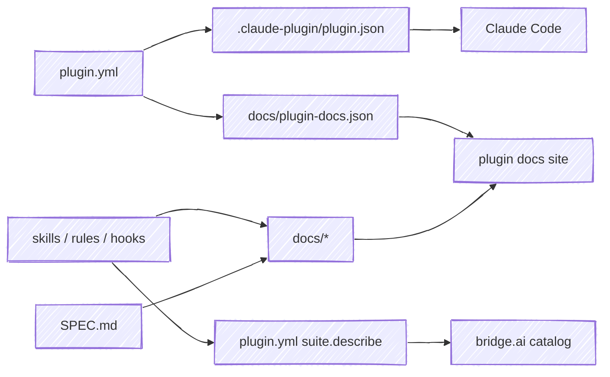

# shipyard

Shared build tooling for [chris-peterson's Claude Code plugins](https://chris-peterson.github.io/claude-marketplace/) — the plugins behind **bridge.ai**.

Every plugin repo used to carry its own copy of the same build scripts and CI workflows. A fix had to be made once per repo, and drifted in between. shipyard holds that logic **once**; each plugin fetches it and calls it.

## The principle: source is the source of record

A plugin's own files are the truth. shipyard never invents copy — it **projects** each source into the generated, committed artifacts that Claude Code, the plugin's docs site, and the marketplace consume.

Because the descriptions come *from* the artifacts (a skill's `SKILL.md`, a hook's `description:` in `hooks.yml`, its event/matcher wiring), the catalog and docs can't drift from what the plugin actually does.

## Commands

Every command runs against a target plugin repo (`--root <path>`, default: the current directory), so shipyard operates on a checked-out plugin, not on itself.

| Command | Projection |
|---|---|
| `shipyard gen-plugin-json` | `plugin.yml` → `.claude-plugin/plugin.json` |
| `shipyard gen-describe` | source (skills/rules/hooks) → `plugin.yml` `suite.describe` |
| `shipyard gen-plugin-docs` | `plugin.yml` `suite:` → `docs/plugin-docs.json` |
| `shipyard build-docs` | `skills`,`rules`,`guides`,`templates`,`SPEC.md` → `docs/` (+ the docsify `index.html`, from `plugin.yml` `docs:`, and the home page `_home.md`, from `suite:`) |
| `shipyard release --bump <level>` | `CHANGELOG.md`'s `## Unreleased` + the recorded version → the next version, the retitled section, and the notes to publish |
| `shipyard gen-cli-manifest` | the CLI declared in `plugin.yml` `cli:` → its committed grammar manifest |
| `shipyard generate` | run every generator; CI runs this and commits the result to the branch |

### Aggregating plugins

A marketplace or catalog site is the other kind of target. It declares a `plugins.yml` — its identity plus the roster, and nothing about the plugins themselves — and shipyard reads each plugin's own `plugin.yml` from a sibling checkout for the rest. So a description reworded in a plugin's repo reaches the marketplace by regenerating, not by a second hand-edit somewhere else.

| Command | Projection |
|---|---|
| `shipyard roster` | `plugins.yml` → `name<TAB>url` pairs, resolvable before anything is cloned |
| `shipyard gen-marketplace-json` | `plugins.yml` + the plugins' `plugin.yml` → `.claude-plugin/marketplace.json` |
| `shipyard gen-plugins-js` | the plugins' `suite:` blocks → `docs/plugins.js` |
| `shipyard gen-deps-json` | the plugins' `suite.dependencies` → `docs/deps.json` |

`generate` dispatches on the manifest at `--root`, so one verb covers both kinds of target.

## How a plugin uses it

One touch-point in each plugin repo — no packaged install, and nothing to run locally to *build* an artifact:

- **`.github/workflows/`** — `release.yml` and `deploy-docs.yml` are one-line callers of shipyard's [reusable workflows](https://docs.github.com/actions/using-workflows/reusing-workflows), and `project.yml` runs the plugin's own build before shipyard's [`project` action](how-it-works.md#the-projection-job), which projects every artifact and pushes the result to the branch.

All of them pin the same major-version ref, and a repo is on one line or the other, never a mix. Two lines are live while the projection shape is being piloted: `@v1` is the workflow-only shape that predates it, `@v2` is the one described here. Reading what CI would have written is a separate path that stays available — see [debugging a red projection job](how-it-works.md#debugging-a-red-projection-job).

Read on: **[How it works](how-it-works.md)** for the projection and CI flows, **[Cutting a release](releasing.md)** for the contract every harness that publishes one has to follow, or the **[before/after walk-through](example.md)** of converting a real plugin.

---

Source: [github.com/chris-peterson/shipyard](https://github.com/chris-peterson/shipyard).
