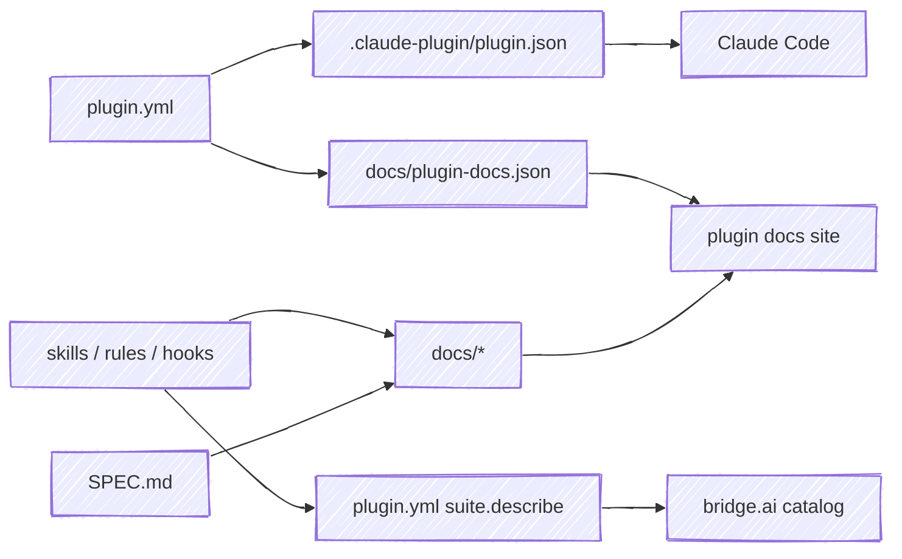

# shipyard

Shared build tooling for [chris-peterson's Claude Code plugins](https://chris-peterson.github.io/claude-marketplace/) — the eight plugins behind **bridge.ai** (anchor, beacon, ClaudeWatch, logbook, moor, sextant, shipshape, tack).

Every plugin repo used to carry its own copy of the same build scripts and CI workflows. A fix had to be made eight times and drifted in between. shipyard holds that logic **once**; each plugin fetches it and calls it.

## The principle: source is the source of record

A plugin's own files are the truth. shipyard never invents copy — it **projects** each source into the generated, committed artifacts that Claude Code, the plugin's docs site, and the marketplace consume.

Because the descriptions come *from* the artifacts (a skill's `SKILL.md`, a hook's `description:` in `hooks.yml`, its event/matcher wiring), the catalog and docs can't drift from what the plugin actually does.

## Commands

Every command runs against a target plugin repo (`--root <path>`, default: the current directory), so shipyard operates on a checked-out plugin, not on itself.

| Command | Projection |
|---|---|
| `shipyard gen-plugin-json` | `plugin.yml` → `.claude-plugin/plugin.json` |
| `shipyard gen-describe` | source (skills/rules/hooks) → `plugin.yml` `suite.describe` |
| `shipyard gen-plugin-docs` | `plugin.yml` `suite:` → `docs/plugin-docs.json` |
| `shipyard build-docs` | `skills`,`rules`,`guides`,`templates`,`SPEC.md` → `docs/` |
| `shipyard changelog` | a release body → `CHANGELOG.md` |
| `shipyard generate` | run every generator (write); `--dry-run` validates source + diffs pending output without writing (the CI gate) |

## How a plugin uses it

Two thin touch-points in each plugin repo — no packaged install:

- **`scripts/shipyard`** — a wrapper that clones shipyard to a cache, fast-forwards it, and runs `python3 -m shipyard` in place. `just` and the pre-commit hook drive it.
- **`.github/workflows/`** — `release.yml`, `deploy-docs.yml`, and `preview.yml` are one-line callers of shipyard's [reusable workflows](https://docs.github.com/actions/using-workflows/reusing-workflows).

Both are pinned to the same ref: **`@main`** while shipyard is pre-1.0 (float to latest), moving to semver tags at v1.

Read on: **[How it works](how-it-works.md)** for the projection and CI flows, or the **[before/after walk-through](example.md)** of converting a real plugin.

---

Source: [github.com/chris-peterson/shipyard](https://github.com/chris-peterson/shipyard).
