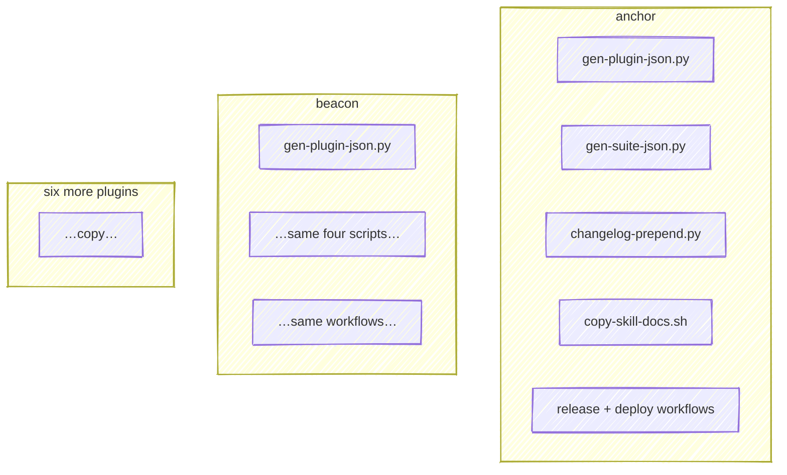
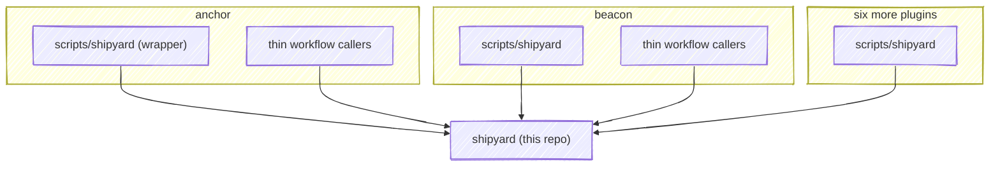

# Example: converting a plugin

A walk-through of the real conversion of [**anchor**](https://github.com/chris-peterson/anchor) — the pilot, merged in [anchor#25](https://github.com/chris-peterson/anchor/pull/25) and shipped as `v0.22.2`.

## Before: every plugin carried the same scripts

Each repo had its own copies of the build logic and workflows. A fix to any of them had to be repeated in eight places.



anchor's `scripts/` held `gen-plugin-json.py`, `gen-suite-json.py`, `changelog-prepend.py`, and `copy-skill-docs.sh`; its `plugin.yml` carried a hand-written `describe:` block.

## After: fetch shipyard, call it



The four scripts are gone; `scripts/shipyard` and three one-line workflow callers replace them. The conversion was a **net −188 lines** in anchor.

## The `describe` is now derived, not written

Before, the catalog copy was hand-authored in `plugin.yml`. It could — and did — drift from the source. anchor's `commit` skill read:

```yaml
# before — hand-written, embellished
commit: "Stage changes, run tests, and write a why-first commit message."
```

The skill's actual `SKILL.md` says *"Stage changes, run tests, and write a commit message."* — no "why-first". After conversion, `gen-describe` takes the source verbatim:

```yaml
# after — generated from skills/commit/SKILL.md
commit: Stage changes, run tests, and write a commit message.
```

If the tooltip reads wrong, you fix the `SKILL.md` — the one place that description belongs — and every consumer follows.

## Hooks carry their own one-liner

Each hook's `description:` lives beside it in `hooks/hooks.yml`, and `gen-describe` combines it with the event wiring `gen-hooks-json` projected into `hooks.json`. For a plugin whose hook delegates to an engine script, the wiring surfaces it — ClaudeWatch's watchdog, for instance:

```
PreToolUse→watchdog (Bash, Write|Edit); SessionStart→cli-freshness, emit-rules
```

## Converting your own plugin

1. Declare hooks in `hooks/hooks.yml` (`event`, `matcher?`, `command`, `description`); `gen-hooks-json` generates `hooks.json`.
2. Copy `scripts/shipyard` and the three workflow callers from anchor; point them at `@main`.
3. Delete the local build scripts; wire `justfile` and the pre-commit hook to the wrapper.
4. Run `shipyard gen-describe`, `shipyard gen-plugin-json`, `shipyard build-docs`, and confirm `shipyard generate --dry-run` runs clean.
5. Open the PR — the reusable `preview` workflow validates the source and posts the pending projection in CI.

Not every plugin fits the generic renderer. A plugin with a bespoke docs pipeline can use shipyard for only the generators, preview, and release and keep its own rendering — a deliberate per-plugin exception.
