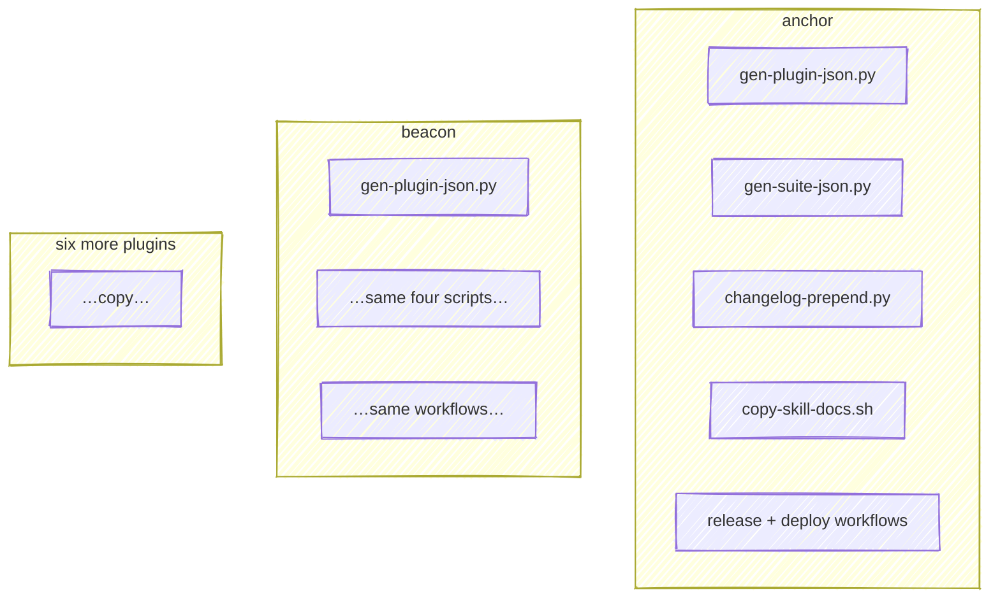
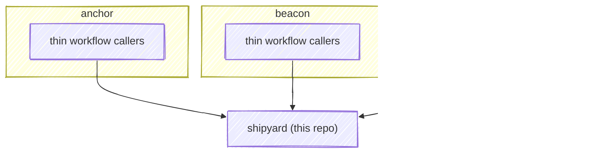

# Example: converting a plugin

A walk-through of the real conversion of [**anchor**](https://github.com/chris-peterson/anchor) — the pilot, merged in [anchor#25](https://github.com/chris-peterson/anchor/pull/25) and shipped as `v0.22.2`.

## Before: every plugin carried the same scripts

Each repo had its own copies of the build logic and workflows. A fix to any of them had to be repeated once per repo.



anchor's `scripts/` held `gen-plugin-json.py`, `gen-suite-json.py`, `changelog-prepend.py`, and `copy-skill-docs.sh`; its `plugin.yml` carried a hand-written `describe:` block.

## After: CI calls shipyard



The four scripts are gone, replaced by one-line workflow callers. Nothing in the plugin runs shipyard: the projection job does, on every push, and commits what it wrote back to the branch.

## The `describe` is now derived, not written

Before, the catalog copy was hand-authored in `plugin.yml`. It could — and did — drift from the source. anchor's `commit` skill read:

```yaml
# before — hand-written, embellished
commit: "Stage changes, run tests, and write a why-first commit message."
```

The skill's actual `SKILL.md` says *"Stage changes, run tests, and write a commit message."* — no "why-first". After conversion, `gen-describe` takes the source verbatim:

```yaml
# after — generated from skills/commit/SKILL.md
commit: Stage changes, run tests, and write a commit message.
```

If the tooltip reads wrong, you fix the `SKILL.md` — the one place that description belongs — and every consumer follows.

## Hooks carry their own one-liner

Each hook's `description:` lives beside it in `hooks/hooks.yml`, and `gen-describe` combines it with the event wiring `gen-hooks-json` projected into `hooks.json`. For a plugin whose hook delegates to an engine script, the wiring surfaces it — ClaudeWatch's watchdog, for instance:

```
PreToolUse→watchdog (Bash, Write|Edit); SessionStart→cli-freshness, emit-rules
```

## Converting your own plugin

1. Declare hooks in `hooks/hooks.yml` (`event`, `matcher?`, `command`, `description`); `gen-hooks-json` generates `hooks.json`.
2. Copy the workflow callers from anchor, pinned at `@v2` — the projection shape doesn't exist on the `v1` line. The projection caller grants its job `contents: write` and checks out the head ref before shipyard's [`project` action](how-it-works.md#the-projection-job). A plugin that declares a `cli:` block runs its own build first, because `gen-cli-manifest` has to invoke the built CLI; a plugin with no `cli:` block has nothing to build and the action follows the checkout directly.
3. Delete the local build scripts, and any `just` target or pre-commit hook that ran one — CI is the writer now. Replace the one that read the projection with the suite's `check` recipe, described under [debugging a red projection job](how-it-works.md#debugging-a-red-projection-job). `generate --dry-run` existed on the `v1` line and does not on this one, so a recipe built on it fails with an argparse error rather than a missing-flag message.
4. Git-ignore what the projection doesn't commit, so the action doesn't stage it. `build-docs` renders more pages than the `v1` line did, and the action stages with `git add -A`, so an ignore file that enumerates the rendered pages silently commits the next one shipyard adds. Ignore the directory and negate the sources you hand-authored instead — `docs/README.md`, `docs/_sidebar.md`, and `docs/favicon.svg` at minimum, plus any page of your own. The list is per-plugin, so verify it rather than copying one: after the edit, this must print nothing.

   ```bash
   for f in $(git ls-files); do git check-ignore -q "$f" && echo "$f"; done
   ```

5. Run `shipyard validate` before you push. The projection job gates on it, so a warning `plugin.yml` hasn't accepted turns the first `@v2` run red *before* the commit step, and the report is only visible in the run. Nearly every repo in this suite draws the same one: a root `CLAUDE.md` is not context the plugin ships, and is accepted by name under [`validate: accept:`](how-it-works.md#validation) with a reason. Reproducing CI's verdict needs `claude` on your PATH; the action pins a version, so a local pass is close to but not identical to the run's.
6. Open the PR. The projection job pushes the regenerated artifacts onto your branch, so the first thing to review is what it wrote.

Not every plugin fits the generic renderer. A plugin with a bespoke docs pipeline can use shipyard for only the generators and release and keep its own rendering — a deliberate per-plugin exception.
