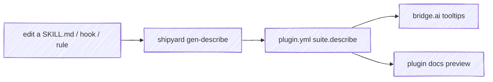
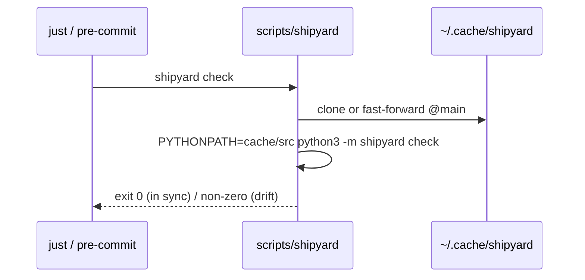
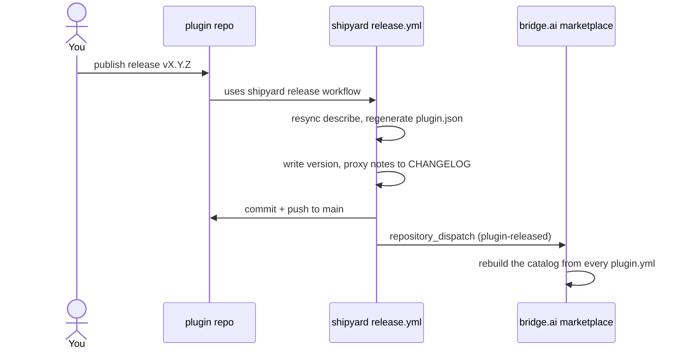

# How it works

Two halves: the **generators** that project source into artifacts, and the **reusable CI** that runs them in each plugin.

## Generators

Each generator reads a plugin's canonical source and writes a committed artifact.

- **`gen-plugin-json`** — projects the packaging fields of `plugin.yml` into `.claude-plugin/plugin.json` (the file Claude Code reads at install), including `homepage` from the `marketplace:` block.
- **`gen-describe`** — the interesting one. It derives a one-line description for every artifact from the artifact's *own* source, and syncs them into `plugin.yml` between generated markers:

  | Artifact | Description comes from |
  |---|---|
  | skill | the first sentence of its `SKILL.md` `description:` |
  | command | the first sentence of its command `description:` |
  | rule | the rule file's first `#` heading |
  | hook | its `# DOCUMENTATION:` line + the event/matcher it's wired to in `hooks.json` |

  A hook script therefore must carry a `# DOCUMENTATION:` line below its shebang — missing it is a hard error, not a silent fallback.

- **`build-docs`** — renders `skills/`, `rules/`, `guides/`, `templates/`, and `SPEC.md` into `docs/`, plus `suite.json`. The plugin's docsify site serves the result; nothing is hand-maintained twice.

The marker block `gen-describe` writes means editing is one-directional — you change the source, run the generator, and the committed copy follows:

## The wrapper: fetch-and-run, no install

`scripts/shipyard` in each plugin keeps a cached checkout of shipyard and runs it in place — no package to publish or pin a version of the interpreter against.

## The check gate

A plugin's CI calls shipyard's reusable `check` workflow on every push and pull request. It fetches shipyard, then verifies the committed `plugin.json` and `suite.describe` still match source — catching a stale artifact before it merges.

## The release flow

Publishing a GitHub release on a plugin fires its `release.yml`, a one-line caller of shipyard's reusable release workflow. shipyard does the rest and hands off to the marketplace.

Nothing here is plugin-specific — the plugin name comes from the repository — so the same reusable workflow drives all eight.
