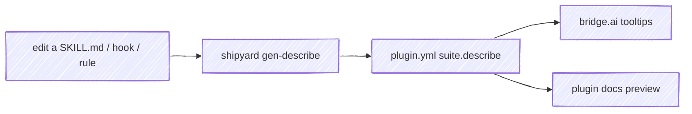
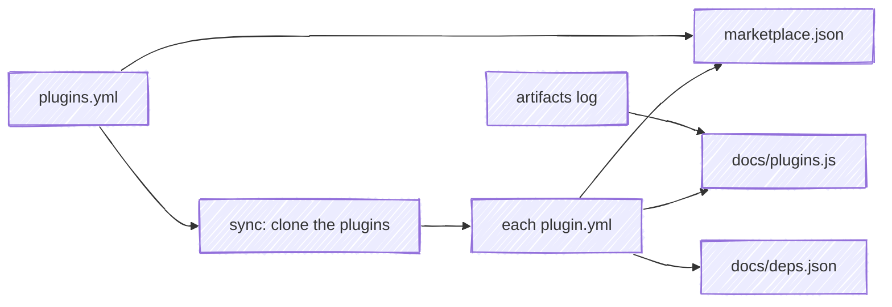
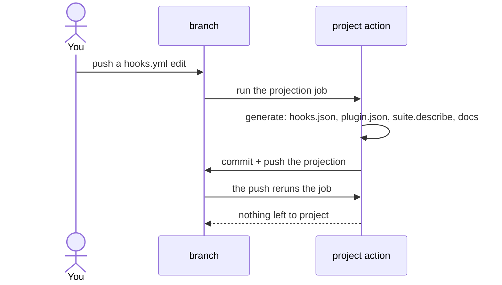
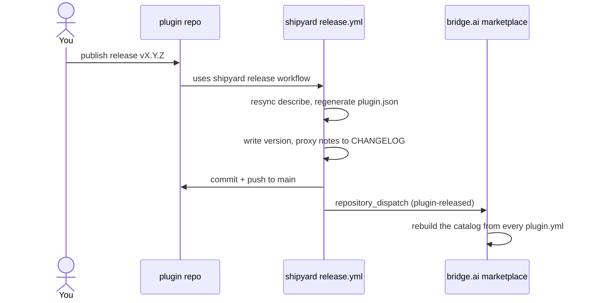

# How it works

Two halves: the **generators** that project source into artifacts, and the **reusable CI** that runs them in each plugin.

## Two kinds of target

shipyard runs against a checked-out repo, and tells what kind it is from the manifest at its root: a **plugin** carries `plugin.yml`, an **aggregator** carries `plugins.yml`. `generate` dispatches on that, so there is one projection verb rather than two command families to keep in sync.

The distinction is about who owns which fact. A plugin owns everything about itself. An aggregator owns only the roster — which plugins it presents, and in what order — and reads the rest off the plugins themselves.

## Generators

Each generator reads a plugin's canonical source and writes a committed artifact.

- **`gen-plugin-json`** — projects the packaging fields of `plugin.yml` into `.claude-plugin/plugin.json` (the file Claude Code reads at install), including `homepage` from the `marketplace:` block.
- **`gen-describe`** — the interesting one. It derives a one-line description for every artifact from the artifact's *own* source, and syncs them into `plugin.yml` between generated markers:

  | Artifact | Description comes from |
  |---|---|
  | skill | the first sentence of its `SKILL.md` `description:` |
  | command | the first sentence of its command `description:` |
  | rule | the rule file's first `#` heading |
  | hook | its `description:` in `hooks/hooks.yml` + the event/matcher it's wired to |

  Hooks are declared in `hooks/hooks.yml` — the source of record, a flat, commentable list of `{event, matcher?, command, description}` — which **`gen-hooks-json`** projects into the `hooks/hooks.json` Claude Code reads (the same source → generated split as `plugin.yml` → `plugin.json`). `gen-describe` reads each hook's `description:` straight from `hooks.yml`, so the hook scripts carry no `# DOCUMENTATION:` line.

- **`gen-cli-manifest`** — for a plugin whose primary surface is a CLI. Its command and flag grammar is a public contract callers script against, and nothing recorded it: a renamed flag reached users as an unexplained behavior change, with no diff anywhere that named it. This generator runs the CLI, parses its help output, and writes a structured manifest the repo commits.

  It's the only generator whose source of record is a running program rather than a file, so the repo declares how to reach it:

  ```yaml
  cli:
    invoke: node dist/cli.js     # how to run it
    engine: usage-lines          # which help-output parser to use
    manifest: spec/v1/cli.yml    # where the recording lands
  ```

  `invoke` keeps shipyard engine-agnostic about *running* a CLI — it shells out to whatever you declare — while `engine` picks the parser, since a framework's help format is its own. A plugin that declares no `cli:` block is unaffected.

  Two things follow from the manifest being a recording of help output. It asserts what the CLI *documents*, which is not the same claim as what it accepts — a flag absent from `--help` is absent here. And it's never hand-edited: each run rewrites it, and a CLI whose help the engine can't parse fails the generator instead of writing a half-manifest, which would read exactly like a CLI that dropped half its commands.

  **This is the projection that needs the caller's own toolchain.** Every other one reads files the checkout already has; this one runs the CLI, which has to be built first. That's why the projection ships as an action you put in your own job after your build step, rather than a workflow that owns the job. What lands in the diff is the grammar itself:

  ```text
  - tack deliverable rm <slug> <tack-id> [--to-link]
  + tack deliverable rm <slug> <tack-id>
  ```

- **`build-docs`** — renders `skills/` (with each skill's own `references/`), `rules/`, `guides/`, `templates/`, `references/`, `SPEC.md`, `STATUS.md`, and any versioned `spec/<version>/SPEC.md` into `docs/`, plus `plugin-docs.json`. A committed CLI manifest also becomes a `docs/cli.md` command reference, which is where the recording pays for itself twice: the page can't drift from the binary the way a hand-maintained command table does. It renders from the *committed* manifest, so building the docs never needs the CLI built. When `plugin.yml` carries a `docs:` block it also projects the docsify `docs/index.html` (title/description from the packaging fields; `code_languages` and `mermaid` from `docs:`; the session player when a `suite:` is present) — so the bootstrap lives here once instead of a hand-copied file per plugin. The plugin's docsify site serves the result; nothing is hand-maintained twice.

  When a `suite:` is present it also renders **`docs/_home.md`** — the plugin's home page, projected from the same block the bridge.ai catalog card is built from, so the two surfaces describe a plugin identically without either being written twice. The page carries the gloss, the pitch, and the install command, then the `describe:` map as a table of skills, rules, and hooks, each linked to the page this build renders for it; `cmds` supplies the author's own copy for the skills it names; `dependencies` becomes what the plugin works with.

  It is markdown rather than a rendered widget, so a docs site styles it as its own page — the theme's tables and headings, the copy button docsify already puts on a code fence, links a reader can middle-click. A page embeds it with `[](_home.md ':include')` and keeps whatever it wants to say above and below, so opting in is one line and the plugin's own prose is never displaced.

  Three things markdown has no way to say are inline HTML with a small style block that travels inside the generated page: the tag row, carrying the version — linked to the published release — and a `cli` mark for a plugin whose `suite.cli` says it ships a command you run in your own shell, the same mark the catalog card shows; a lede, since a blockquote renders as the theme's tip callout and files the summary as an aside; and a peer's mark in the *Works with* table. Every value in it resolves through the host theme's own tokens, so the page follows the site into light or dark instead of fixing its own palette. Membership in the suite belongs to the titlebar rather than the page — `projects.yml` already nests a plugin under the marketplace, and the breadcrumb states it once: `chris-peterson / bridge.ai / anchor`.

  `hooks.yml` renders **`docs/hooks.md`** alongside it: a section per hook carrying the event, the matcher, the command, and the script itself, with the home page's hook rows linking into it. A hook is the one artifact with no page of its own, and answering "what does this one do" is a documentation question — so it resolves in the docs, on a page that shows what runs, rather than at a source file on the forge.

  A **dependency** resolves to its docs on the hub by name, which is also what marks it as a peer: peers lead the table and carry their own mark, while a project documenting itself elsewhere declares a `url`, reads as outbound, and sorts to the bottom.

  Only `docs/` is published, so a page's `` resolves only if that file is in the artifact. **Resource paths** put it there: each path the caller names is copied in, with its directory flattened to the docs root, so `assets/hero.svg` is reachable as `hero.svg` — the same placement each plugin's own `cp assets/* docs/` step gave it before shipyard replaced that step. Name them on the build's `resources` input; `assets` applies when you name nothing.

  `build-docs` then resolves every local file reference the rendered pages make against the tree as it will ship, and fails on one it can't. That gate is the point: a reference to a file that isn't published costs nothing at build time and shows up only as a blank space on the live page, which is how one plugin's homepage hero stayed missing for a month behind a green deploy. References inside code fences and inline spans are prose, not references, so a guide that *documents* markdown isn't punished for it.

  **Links get the same treatment, in two steps.** Rendering *moves* a page — `skills/<name>/SKILL.md` is served from `skills/<name>.md` — so a link the source wrote as `../../references/x.md`, correct in the checkout and on the forge, points one level too deep from where the page now sits. No `relativePath` setting fixes that, because the link was written against a depth the published tree doesn't have. So each source's published route is recorded as it renders and its links are rewritten to those routes: one link, working in all three places. Then every link on every page — rewritten or hand-written — is resolved against the shipping tree, and one that reaches no page fails the build, as does a `#fragment` naming an anchor its target page doesn't carry.

  A dead link is worth a gate because it fails *silently*: docsify renders its own 404 inside a page that loaded fine, so the deploy is green and only a reader finds out. Resolution is case-exact whatever the build host does — GitHub Pages is case-sensitive and macOS is not, so `/SPEC` finding `spec.md` on a laptop is precisely the link nobody can reproduce locally.

The marker block `gen-describe` writes means editing is one-directional — you change the source, run the generator, and the committed copy follows:



## Aggregate generators

An aggregator — a marketplace, a catalog site — used to hand-maintain a second copy of every plugin's description, author, category, and homepage. That copy is a projection of facts the plugins already declare, so it drifts: a description reworded in the plugin's own repo has no path to the marketplace except somebody editing it there too.

`plugins.yml` removes the copy. It declares only what the aggregator owns, and the plugins supply the rest:



- **`gen-marketplace-json`** — the roster plus each plugin's `plugin.yml` become the `marketplace.json` Claude Code reads at `marketplace add`. Generated and committed, the same split as `plugin.yml` → `plugin.json` one level up.
- **`gen-plugins-js`** and **`gen-deps-json`** — the doc site's catalog data and dependency graph, projected from the plugins' `suite:` blocks. Render targets, regenerated on every docs build.
- **`roster`** — prints the declared plugins as `name<TAB>url` pairs.

Two design points carry most of the weight:

**`source:` is a URL template, not a per-entry field.** The aggregator's sync step needs to know what to clone *before* any plugin is on disk. Resolving `https://github.com/{owner}/{name}.git` from the roster alone keeps `roster` readable with an empty workspace — which is what lets `marketplace.json` be purely downstream rather than doubling as the list of things to fetch.

**A rostered plugin with no `plugin.yml` is a hard error.** The alternative — skipping it, or falling back to a stale local copy — would publish an incomplete catalog that looks complete. Unsynced plugins fail the build instead.

The artifact log is the one derived input: a rolling record of each plugin's named skills, rules, and hooks that the aggregator's recorder writes from the plugins' git state. shipyard reads it when `plugins.yml` declares an `artifacts:` path, replaying its `+`/`-` tokens to get the current member set, so the catalog can't list a skill a plugin no longer ships. Component names are never declared, only derived.

A plugin may declare a dependency on something the roster doesn't carry — an optional backend the marketplace doesn't ship. Those edges survive into `deps.json` while `nodes` stays the roster; that gap is what lets the doc site's graph draw an outside plugin differently from a catalog one.

## The projection job

Every generated artifact has exactly one writer, and it is CI. A plugin's job runs its own build, then calls shipyard's `project` action, which projects the sources into their artifacts and pushes the result to the branch. The diff a reviewer approves is the change that lands, and a committed artifact matches its source at all times rather than only after a release.

```yaml
jobs:
  project:
    runs-on: ubuntu-latest
    permissions:
      contents: write
    steps:
      - uses: actions/checkout@v6
        with:
          # The default checkout leaves a merge commit in detached HEAD, and
          # there is no branch there to push a projection to.
          ref: ${{ github.head_ref }}
      - run: npm ci && npm run build          # whatever your CLI needs, first
      - uses: chris-peterson/shipyard/actions/project@v1
```

An action rather than a reusable workflow, because the caller's own job has to run first: a CLI manifest needs a built CLI to interrogate, and compiled output has to compile before it can be projected. A reusable workflow owns the whole job, so it could only take that build as a string to interpolate — awkward, and a script-injection surface.



The job terminates on its own: its push triggers a rerun that finds nothing to project and pushes nothing, so there is one extra run per drifted commit and no `paths-ignore` bookkeeping. An author who pushed while it ran gets a rejected fast-forward rather than a corrupted branch — no force, no lease — and their next push carries a run that redoes the projection.

**What gets committed** has one test: commit a projection if, and only if, a consumer reads it out of the repo. `plugin.json`, `hooks.json`, `marketplace.json`, a CLI manifest and compiled output a plugin ships, yes — the clone is the delivery mechanism, and Claude Code runs no install step. Rendered `docs/` and the marketplace's data files, no; both are git-ignored and built at deploy. The action stages every non-ignored change, so a build output you don't want committed belongs in `.gitignore`.

**There is no drift gate, and nothing runs shipyard on a laptop.** A gate is what you build when the writer is a person with a local tool: CI can't produce the artifact, so it checks whether you remembered, and its failure message can only ever be *"run `generate` and commit"*.

## The release flow

Publishing a GitHub release on a plugin fires its `release.yml`, a one-line caller of shipyard's reusable release workflow. shipyard does the rest and hands off to the marketplace.



Nothing here is plugin-specific — the plugin name comes from the repository — so one reusable workflow drives every plugin.

What the person (or agent) publishing the release is responsible for, and what to leave to CI, is in **[Cutting a release](releasing.md)**.
