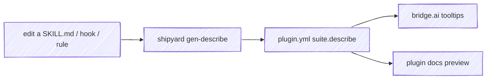
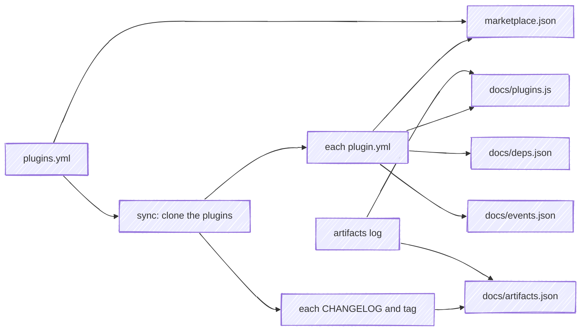
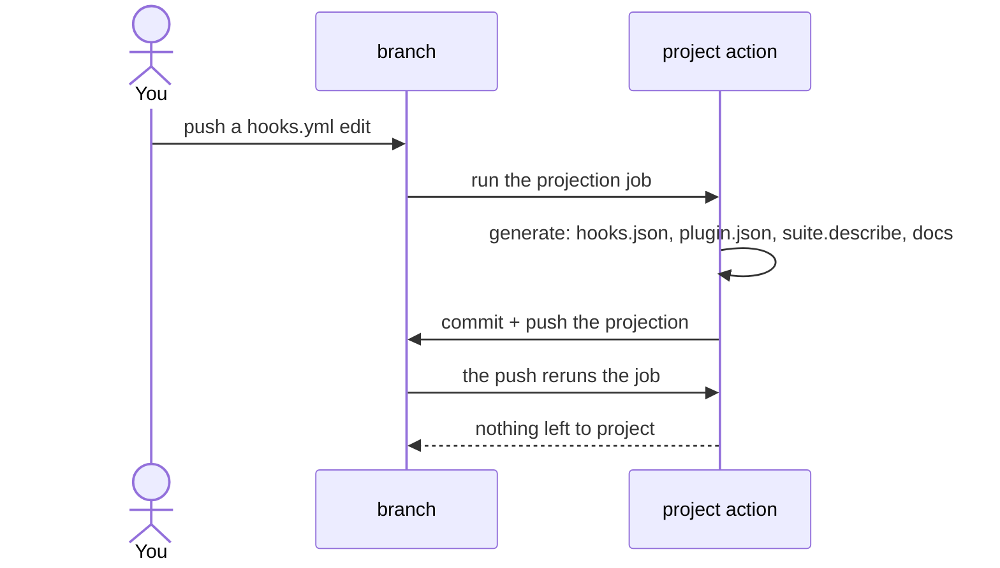
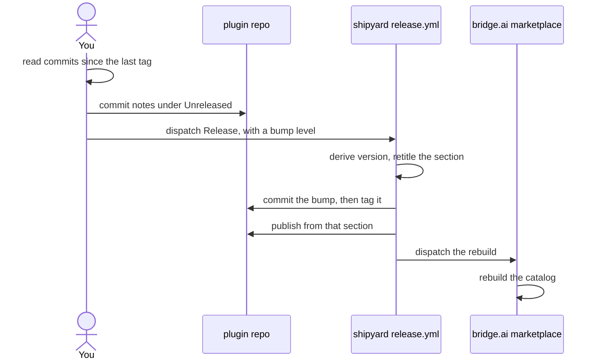

# How it works

Two halves: the **generators** that project source into artifacts, and the **reusable CI** that runs them in each plugin.

## Two kinds of target

shipyard runs against a checked-out repo, and tells what kind it is from the manifest at its root: a **plugin** carries `plugin.yml`, an **aggregator** carries `plugins.yml`. `generate` dispatches on that, so there is one projection verb rather than two command families to keep in sync.

The distinction is about who owns which fact. A plugin owns everything about itself. An aggregator owns only the roster — which plugins it presents, and in what order — and reads the rest off the plugins themselves.

## Generators

Each generator reads a plugin's canonical source and writes a committed artifact.

- **`gen-plugin-json`** — projects the packaging fields of `plugin.yml` into `.claude-plugin/plugin.json` (the file Claude Code reads at install), including `homepage` from the `marketplace:` block.
- **`gen-describe`** — the interesting one. It derives a one-line description for every artifact from the artifact's *own* source, and syncs them into `plugin.yml` between generated markers:

  | Artifact | Description comes from |
  |---|---|
  | skill | the first sentence of its `SKILL.md` `description:` |
  | command | the first sentence of its command `description:` |
  | rule | the rule file's first `#` heading |
  | hook | its `description:` in `hooks/hooks.yml` + the event/matcher it's wired to |

  Hooks are declared in `hooks/hooks.yml` — the source of record, a flat, commentable list of `{event, matcher?, command, description}` — which **`gen-hooks-json`** projects into the `hooks/hooks.json` Claude Code reads (the same source → generated split as `plugin.yml` → `plugin.json`). `gen-describe` reads each hook's `description:` straight from `hooks.yml`, so the hook scripts carry no `# DOCUMENTATION:` line.

- **`gen-cli-manifest`** — for a plugin whose primary surface is a CLI. Its command and flag grammar is a public contract callers script against, and nothing recorded it: a renamed flag reached users as an unexplained behavior change, with no diff anywhere that named it. This generator runs the CLI, parses its help output, and writes a structured manifest the repo commits.

  It's the only generator whose source of record is a running program rather than a file, so the repo declares how to reach it:

  ```yaml
  cli:
    invoke: node dist/cli.js     # how to run it
    engine: usage-lines          # which help-output parser to use
    manifest: spec/v1/cli.yml    # where the recording lands
  ```

  **Grammar and organisation have different sources, and the manifest carries both.** Help output knows every command and flag, and nothing about which ones belong together, what a worked example looks like, or what a reader needs to know before the first one. A person knows all three, and can't be trusted to keep a list of commands current — the hand-written page this replaced in tack was missing three of thirty-five, including a whole `repo` family that had shipped a release. So the same block declares how the reference reads:

  ```yaml
  cli:
    lede: |
      Tack ids display as `t<N>`; the bare number works too.
    groups:
      - name: Routes
        about: Making and inspecting routes.
        commands: [init, rename, list, tree]
      - name: Tacks
        commands: [add, edit, start, done]
    examples:
      tree:
        - run: tack tree '*/*/deliverable'
          note: All deliverables (`**` matches across levels).
  ```

  **The generator refuses any disagreement between the two.** A group naming a command the help doesn't document is an error, and so is a documented command that no group lists. That second check is the one that pays: an ungrouped command is one the page would silently omit, which is exactly how the hand-written page lost `repo`. It's also the check no hand-written page can perform on itself.

  Declaring nothing is fine — the page is then a flat list of every command, which is complete but not organised. Every manifest written before these fields existed stays valid, so the published schema is still `v1`.

  `invoke` keeps shipyard engine-agnostic about *running* a CLI — it shells out to whatever you declare — while `engine` picks the parser, since a framework's help format is its own. A plugin that declares no `cli:` block is unaffected.

  | `engine` | Reads | Invocations |
  |---|---|---|
  | `usage-lines` | a hand-written `Usage:` block, one invocation form per line | one |
  | `argparse` | Python's argparse, whose per-command grammar is printed only by that command | one per command |

  The difference in the third column is what a CLI's own help decides. A `Usage:` block states the whole tree at once; argparse gives the top-level help a list of subcommand names and their one-line summaries, and nothing about what any of them takes. So the argparse engine probes — it runs `<invoke> <command> --help` for each name it found, and again for each name those turn up. One thing it declines to record is the `-h` argparse adds to every parser: repeated on every command it freezes the framework's boilerplate rather than the CLI's grammar, and its absence from a diff could never mean anything. The root usage keeps it, where `prog --help` is a form a reader calls.

  Two things follow from the manifest being a recording of help output. It asserts what the CLI *documents*, which is not the same claim as what it accepts — a flag absent from `--help` is absent here. And it's never hand-edited: each run rewrites it, and a CLI whose help the engine can't parse fails the generator instead of writing a half-manifest, which would read exactly like a CLI that dropped half its commands.

  **This is the projection that needs the caller's own toolchain.** Every other one reads files the checkout already has; this one runs the CLI, which has to be built first. That's why the projection ships as an action you put in your own job after your build step, rather than a workflow that owns the job. What lands in the diff is the grammar itself:

  ```text
  - tack deliverable rm <slug> <tack-id> [--to-link]
  + tack deliverable rm <slug> <tack-id>
  ```

- **`build-docs`** — renders `skills/` (with each skill's own `references/`), `rules/`, `guides/`, `templates/`, `references/`, `SPEC.md`, `STATUS.md`, and any versioned `spec/<version>/SPEC.md` into `docs/`, plus `plugin-docs.json`. A committed CLI manifest also becomes a `docs/cli.md` command reference, which is where the recording pays for itself twice: the page can't drift from the binary the way a hand-maintained command table does. It renders from the *committed* manifest, so building the docs never needs the CLI built. When `plugin.yml` carries a `docs:` block it also projects the docsify `docs/index.html` (title/description from the packaging fields; `code_languages` and `mermaid` from `docs:`; the session player when a `suite:` is present) — so the bootstrap lives here once instead of a hand-copied file per plugin. The plugin's docsify site serves the result; nothing is hand-maintained twice.

  **A skill's page opens on the command that runs it.** `/<plugin>:<skill>` goes
  in a fence directly under the page's title, which is where docsify's copy button
  lands; an inline code span gets no button, so the fence is the treatment. The
  two surfaces want different things from the same source: the skill body
  addresses an agent already inside the skill, while a reader who navigated to its
  page is there to find out what to type.

  When a `suite:` is present it also renders **`docs/_home.md`** — the plugin's home page, projected from the same block the bridge.ai catalog card is built from, so the two surfaces describe a plugin identically without either being written twice. The page carries the gloss, the pitch, and the install command, then the `describe:` map as a table of skills, rules, and hooks, each linked to the page this build renders for it; `cmds` supplies the author's own copy for the skills it names; `dependencies` becomes what the plugin works with.

  It is markdown rather than a rendered widget, so a docs site styles it as its own page — the theme's tables and headings, the copy button docsify already puts on a code fence, links a reader can middle-click. A page embeds it with `[](_home.md ':include')` and keeps whatever it wants to say above and below, so opting in is one line and the plugin's own prose is never displaced.

  Three things markdown has no way to say are inline HTML with a small style block that travels inside the generated page: the tag row, carrying the version — linked to the published release — and a `cli` mark for a plugin whose `suite.cli` says it ships a command you run in your own shell, the same mark the catalog card shows; a lede, since a blockquote renders as the theme's tip callout and files the summary as an aside; and a peer's mark in the *Works with* table. Every value in it resolves through the host theme's own tokens, so the page follows the site into light or dark instead of fixing its own palette. Membership in the suite belongs to the titlebar rather than the page — `projects.yml` already nests a plugin under the marketplace, and the breadcrumb states it once: `chris-peterson / bridge.ai / anchor`.

  `hooks.yml` renders **`docs/hooks.md`** alongside it: a section per hook carrying the event, the matcher, the command, and the script itself, with the home page's hook rows linking into it. A hook is the one artifact with no page of its own, and answering "what does this one do" is a documentation question — so it resolves in the docs, on a page that shows what runs, rather than at a source file on the forge.

  A **dependency** resolves to its docs on the hub by name, which is also what marks it as a peer: peers lead the table and carry their own mark, while a project documenting itself elsewhere declares a `url`, reads as outbound, and sorts to the bottom.

  A plugin can publish pages this build has no renderer for — ClaudeWatch's `rules.md` and `prompts.md`, a block/ask reference table and a permission-prompt gallery built from its own `watches/*.yml`, which nothing here knows how to read. **`docs: pre_render:`** names the command(s) that produce them, run from the plugin root before anything else in this list — including the link check below, which scans every page under `docs/` and would otherwise see a page one of these commands hasn't written yet as a dead link rather than one that's merely late.

  ```yaml
  docs:
    pre_render: python3 build/gen-rules-doc.py
  ```

  Only `docs/` is published, so a page's `` resolves only if that file is in the artifact. **Resource paths** put it there: each path the caller names is copied in, with its directory flattened to the docs root, so `assets/hero.svg` is reachable as `hero.svg` — the same placement each plugin's own `cp assets/* docs/` step gave it before shipyard replaced that step. Declare them in `plugin.yml`, which is also what lets a local `build-docs` reproduce CI's; `assets` applies when you name nothing.

  ```yaml
  docs:
    resources:
      - assets
      - vendor/screenshots
  ```

  `build-docs` then resolves every local file reference the rendered pages make against the tree as it will ship, and fails on one it can't. That gate is the point: a reference to a file that isn't published costs nothing at build time and shows up only as a blank space on the live page, which is how one plugin's homepage hero stayed missing for a month behind a green deploy. References inside code fences and inline spans are prose, not references, so a guide that *documents* markdown isn't punished for it.

  **Links get the same treatment, in two steps.** Rendering *moves* a page — `skills/<name>/SKILL.md` is served from `skills/<name>.md` — so a link the source wrote as `../../references/x.md`, correct in the checkout and on the forge, points one level too deep from where the page now sits. No `relativePath` setting fixes that, because the link was written against a depth the published tree doesn't have. So each source's published route is recorded as it renders and its links are rewritten to those routes: one link, working in all three places. Then every link on every page — rewritten or hand-written — is resolved against the shipping tree, and one that reaches no page fails the build, as does a `#fragment` naming an anchor its target page doesn't carry.

  A dead link is worth a gate because it fails *silently*: docsify renders its own 404 inside a page that loaded fine, so the deploy is green and only a reader finds out. Resolution is case-exact whatever the build host does — GitHub Pages is case-sensitive and macOS is not, so `/SPEC` finding `spec.md` on a laptop is precisely the link nobody can reproduce locally.

The marker block `gen-describe` writes means editing is one-directional — you change the source, run the generator, and the committed copy follows:



## Aggregate generators

An aggregator — a marketplace, a catalog site — used to hand-maintain a second copy of every plugin's description, author, category, and homepage. That copy is a projection of facts the plugins already declare, so it drifts: a description reworded in the plugin's own repo has no path to the marketplace except somebody editing it there too.

`plugins.yml` removes the copy. It declares only what the aggregator owns, and the plugins supply the rest:



- **`gen-marketplace-json`** — the roster plus each plugin's `plugin.yml` become the `marketplace.json` Claude Code reads at `marketplace add`. Generated and committed, the same split as `plugin.yml` → `plugin.json` one level up.
- **`gen-plugins-js`** and **`gen-deps-json`** — the doc site's catalog data and dependency graph, projected from the plugins' `suite:` blocks. Render targets, regenerated on every docs build.
- **`gen-events-json`** — the interop event catalog: each published key paired with the plugins subscribing to it, from both sides' `events:` blocks. The pairing is what shows a key with only one end — `subscribed_only` names a defect, `published_only` usually a rollout mid-flight.
- **`gen-artifacts-json`** — the growth view: the artifact log bucketed into weeks, one entry per dated change point, and every release the plugins have tagged. An aggregator opts in by declaring the log; one without it has no history to plot.
- **`roster`** — prints the declared plugins as `name<TAB>url` pairs. `--include-retired` adds the plugins the groups have retired, which the growth view still reads.

Two design points carry most of the weight:

**`source:` is a URL template, not a per-entry field.** The aggregator's sync step needs to know what to clone *before* any plugin is on disk. Resolving `https://github.com/{owner}/{name}.git` from the roster alone keeps `roster` readable with an empty workspace — which is what lets `marketplace.json` be purely downstream rather than doubling as the list of things to fetch.

**A rostered plugin with no `plugin.yml` is a hard error.** The alternative — skipping it, or falling back to a stale local copy — would publish an incomplete catalog that looks complete. Unsynced plugins fail the build instead.

The artifact log is the one derived input: a rolling record of each plugin's named skills, rules, and hooks that the aggregator's recorder writes from the plugins' git state. shipyard reads it when `plugins.yml` declares an `artifacts:` path, replaying its `+`/`-` tokens to get the current member set, so the catalog can't list a skill a plugin no longer ships. Component names are never declared, only derived.

**A release's notes come from the plugin's own CHANGELOG.md.** The growth view lists a release for every `vX.Y.Z` tag in a plugin's checkout, and reads its notes from the `## <version>` section beside it — the same section `stage-release` retitles, commits, tags, and publishes. So the catalog and the release page cannot say different things, and the projection needs no forge call to find out what shipped. `changelog.teaser` reduces that section to what a listing has room for: the alert it leads with, then each bucket and the bold lead-in of its first few bullets. A tag whose section is missing is listed as a release with no notes rather than skipped.

**A catalog declares its groups; a plugin declares which one it is in.** `groups:` carries each group's key, accent, label, and the plugins it has `retired:`. Membership is the plugin's own `suite.group`, so the aggregator never restates it — and a `suite.group` naming no declared group fails the projection instead of quietly producing a plugin no catalog renders. A retired plugin is the one membership the aggregator does declare, because it has no roster entry left to read it from, and it keeps the group and slot it held while it shipped.

A plugin may declare a dependency on something the roster doesn't carry — an optional backend the marketplace doesn't ship. Those edges survive into `deps.json` while `nodes` stays the roster; that gap is what lets the doc site's graph draw an outside plugin differently from a catalog one.

## The projection job

Every generated artifact has exactly one writer, and it is CI. A plugin's job runs its own build, then calls shipyard's `project` action, which projects the sources into their artifacts and pushes the result to the branch. The diff a reviewer approves is the change that lands, and a committed artifact matches its source at all times rather than only after a release.

```yaml
jobs:
  project:
    runs-on: ubuntu-latest
    permissions:
      contents: write
    steps:
      - uses: actions/checkout@v6
        with:
          # The default checkout leaves a merge commit in detached HEAD, and
          # there is no branch there to push a projection to.
          ref: ${{ github.head_ref }}
      - run: npm ci && npm run build          # whatever your CLI needs, first
      - uses: chris-peterson/shipyard/actions/project@v2
```

An action rather than a reusable workflow, because the caller's own job has to run first: a CLI manifest needs a built CLI to interrogate, and compiled output has to compile before it can be projected. A reusable workflow owns the whole job, so it could only take that build as a string to interpolate — awkward, and a script-injection surface.



The job terminates on its own: its push triggers a rerun that finds nothing to project and pushes nothing, so there is one extra run per drifted commit and no `paths-ignore` bookkeeping. An author who pushed while it ran gets a rejected fast-forward rather than a corrupted branch — no force, no lease — and their next push carries a run that redoes the projection.

**What gets committed** has one test: commit a projection if, and only if, a consumer reads it out of the repo. `plugin.json`, `hooks.json`, `marketplace.json`, a CLI manifest and compiled output a plugin ships, yes — the clone is the delivery mechanism, and Claude Code runs no install step. Rendered `docs/` and the marketplace's data files, no; both are git-ignored and built at deploy. The action stages every non-ignored change, so a build output you don't want committed belongs in `.gitignore`.

**There is no drift gate.** A gate is what you build when the writer is a person with a local tool: CI can't produce the artifact, so it checks whether you remembered, and its failure message can only ever be *"run `generate` and commit"*.

## Validation

The projection job runs `claude plugin validate` over the checkout before it commits anything, so a source that projects into a plugin Claude Code would reject never lands the artifact. The validator reads the manifest and the frontmatter of every skill, agent, and command beside it; it needs no credentials, no config, and no network.

shipyard runs it rather than restating its checks, for the same reason `gen-cli-manifest` invokes a CLI instead of parsing its source: the ruleset belongs to the runtime and moves with it. The version is pinned in the action, because a validator release that adds a check reaches every plugin at once — moving the pin is the deliberate sweep.

**Warnings fail.** The validator's own exit code lets every warning through forever, and `--strict` fails on all of them with no way to say which ones a plugin has already thought about. So shipyard reads the report and fails on both, unless `plugin.yml` accepts the warning by name:

```yaml
validate:
  accept:
    - warning: root
      because: >-
        CLAUDE.md at the root is this repo's own agent instructions, not shipped
        context. It is the only file Claude Code auto-loads, so the shim earns
        the warning.
    - warning: name
      path: .claude-plugin/plugin.json
      because: renaming would break every installed copy.
```

`because` is required: an acceptance with no reason beside it is indistinguishable from a warning somebody silenced to get a build green. `path` is optional, and narrows the acceptance to findings from one file — worth adding when the field name is a common one, since `description` names both a manifest field and a skill's frontmatter.

An acceptance that matches nothing in the report is an error too. The reason it records has outlived the warning it explains, and the next reader would take it for a live exception.

An **error** is never acceptable. An unknown field is a judgment call; a wrong-typed one is a broken plugin.

Run the same check yourself the same way you'd run any other:

```bash
uvx --from 'git+https://github.com/chris-peterson/shipyard@v2' shipyard validate
```

## Debugging a red projection job

Nothing *writes* an artifact from a laptop. Reading what CI would have written is a different thing, and it's what you want the moment the job goes red. shipyard declares a console script, so one command runs the same CLI the action runs, with no checkout and no install:

```bash
uvx --from 'git+https://github.com/chris-peterson/shipyard@v2' shipyard generate
git diff             # what CI would have pushed
git restore .        # discard it; CI is still the only writer
```

`git restore` reverts the committed artifacts, which is all of them in a converted
repo. The exception is the first run after a *new* projection lands: that artifact
arrives untracked, so `git status` is what tells you it's there.

Every plugin in the suite wraps that read in one recipe, and it is named `check` in
all of them:

```just
shipyard := "uvx --from 'git+https://github.com/chris-peterson/shipyard@v2' shipyard"

# read what the projection job would commit, without keeping it; `git restore .` discards
check:
    {{shipyard}} generate
    git --no-pager diff --stat
```

A plugin that declares a `cli:` block writes `check: build` instead, because
`gen-cli-manifest` interrogates the built CLI and there is nothing to interrogate
until the build has run. One name across the suite is the point: `check` is the
recipe to reach for in a repo you haven't opened before.

Pin the same ref your workflows pin. Debugging a `@v2` job against `v1`'s generators reproduces the wrong shape, which is worse than not reproducing it at all.

Every projector reads its input from the checkout, so anything wrong with the *source* reproduces identically — a malformed `plugin.yml` or `hooks.yml`, a dead docs link, a missing resource path, a CLI whose help the engine can't parse. What doesn't reproduce is the job's own machinery: a detached HEAD, a rejected push, a fork's read-only token. Those live only in the run, and the action names the fix in its own error.

`build-docs` writes into a git-ignored `docs/`, so rendering the site to look at it is safe in a way it wasn't when that output was committed:

```bash
uvx --from 'git+https://github.com/chris-peterson/shipyard@v2' shipyard build-docs
npx docsify-cli serve docs
```

## The release flow

A plugin releases through CI. You commit the notes to `CHANGELOG.md`, dispatch its `Release` workflow with a bump level, and the reusable workflow here does the rest in one run. shipyard releases *itself* through `cut.py` — the same ordering, driven from a checkout, because shipyard has no caller of its own to dispatch.



**Three artifacts, one commit.** The notes, the version in `plugin.yml`, and the `plugin.json` projected from it land together as `Release v1.3.0`, and the tag names that commit. So the release body *is* the committed section, the tag names a commit that already carries the version, and the compare link between two tags contains the changelog. Those three used to disagree in whichever way the ordering happened to break that release.

**The version is derived before the tag exists.** The trigger was once `release: published`, so a human cut the tag before any of this ran and the bump commit always landed *after* the tag naming it — `plugin.json` at a tag reported the previous version, and the changelog there had no section for it. Deriving the version inside the run means the tag is cut from a commit that already carries it.

**`CHANGELOG.md` is the source, not a destination.** The release body used to be authored outside the repo at publish time, which made it the source and left nothing constraining its shape — across the suite it took at least three incompatible forms, each now permanent in some changelog. Reading the notes out of the file makes a duplicated or mismatched heading unreachable rather than a shape the parser has to tolerate. It is also why the notes have to be committed *before* the dispatch: the run reads them from `main`.

**The bump is the one thing asked for.** A heading names the kind of change, not whose contract it broke, so no rule reading the prose can tell a breaking `### Changed` from a rewording. The dispatch form asks for the level rather than inferring one it cannot check, and the guidance is to over-bump when the two readings differ: an over-bump spends a version number, an under-bump ships a break to someone pinning a range.

### Where the two drivers differ

The ordering above is identical either way. What changes is where the questions get answered.

| | plugin, via `release.yml` | shipyard, via `cut.py` |
| --- | --- | --- |
| Bump level | chosen in the dispatch form | inferred from the notes' headings, shown, and overridable at the prompt |
| Preflight | the run fails, and you read it afterwards | refusals print before the first write |
| Version and body | visible once the run finishes | printed for confirmation beforehand |
| Branch and tag | pushed in two steps from the runner | pushed together, atomically |
| Who writes the release commit | CI, like every other artifact | the operator's checkout |

That last row is why `cut.py` carries a preflight the workflow has no need of. Everywhere else in the suite the projection job is the only writer, so a local release commit is a carve-out: `plugin.json` is the only committed artifact a release changes, and its version is a one-key projection of `plugin.yml` needing pyyaml and nothing from the plugin's own toolchain. The driver holds that line by refusing to release a checkout whose `plugin.json` doesn't already match its source — that's a commit the projection job still owes the branch, and releasing would land it after the tag.

What the person (or agent) driving either one does, step by step, is in **[Cutting a release](releasing.md)**.
